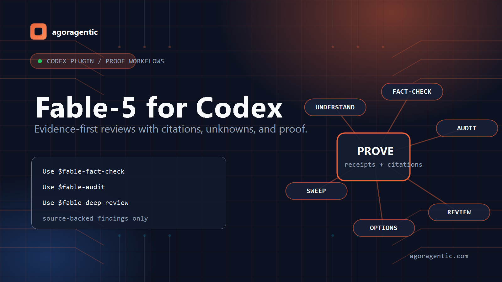
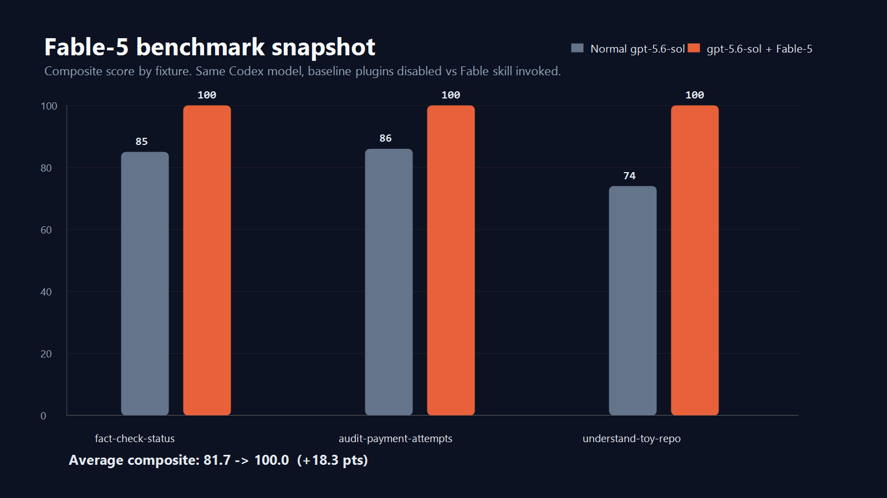
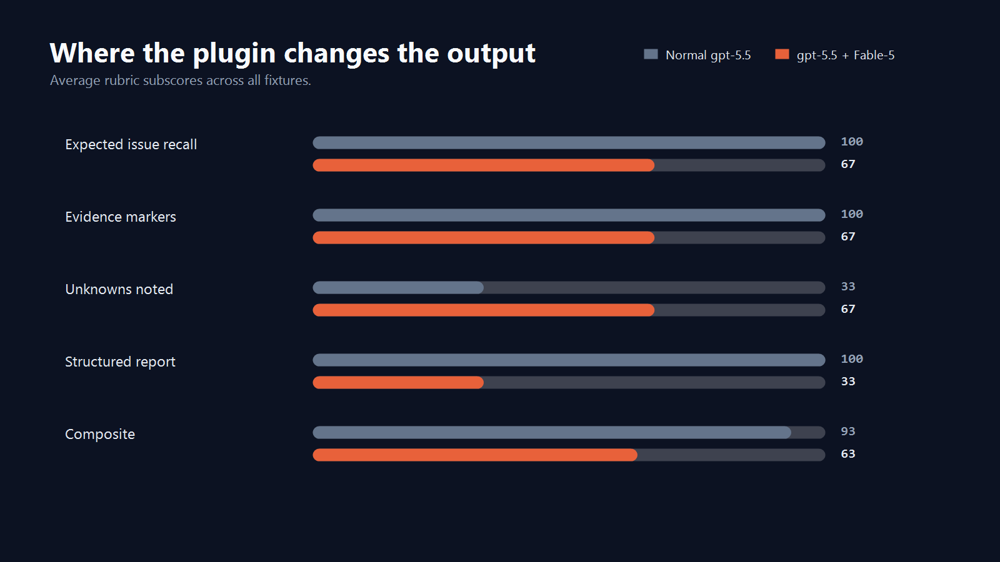

# Fable-5 for Codex

<p align="center">
  
</p>

Fable-5 for Codex is a Codex plugin that packages evidence-first engineering workflows as reusable skills. It is built for audits, deep reviews, fact checks, codebase understanding, design choices, and repo-wide sweeps where source-backed proof matters. The current alpha also ships Micro ECF-style run contracts so Codex can record scope, authority, lenses, evidence policy, verification policy, and a final Workflow Trace.

## What This Repo Contains

- `assets/brand/`: README and repository brand images
- `assets/benchmarks/`: benchmark chart images generated from measured runs
- `benchmarks/`: reproducible baseline-vs-plugin benchmark harness and raw outputs
- `plugins/fable5-codex/`: installable Codex plugin
- `.agents/plugins/marketplace.json`: repo-local marketplace catalog
- `plugins/fable5-codex/references/`: ECF-style run-contract guidance used by the installed skills
- `plugins/fable5-codex/templates/`: starter ECF/Fable run-contract JSON and review contract
- `bin/install.mjs`: GitHub/npx installer for personal or project-local Codex marketplaces
- `examples/`: prompt calls, toy repo, and expected report examples
- `evals/`: fixtures for fact-check, audit, and sweep validation
- `docs/`: method, install, architecture, and schema notes
- `scripts/validate-package.ps1`: local package validation
- `scripts/sync-personal-plugin.ps1`: copy the canonical repo plugin into the personal plugin location

## Skills

- `$fable-audit`: ranked bug, risk, and integration audit
- `$fable-deep-review`: PR or branch review with verification passes
- `$fable-fact-check`: claim-by-claim verification against source/runtime evidence
- `$fable-understand`: source-grounded explanation of how a system works
- `$fable-design-options`: design alternatives with tradeoffs and migration notes
- `$fable-sweep`: repo-wide change workflow with discovery, implementation, and verification

## Subagents

Fable-5 audits now report a visible `Workflow Trace` every time. Large or high-risk Fable tasks use real Codex subagents when the runtime exposes a subagent tool and the user has not opted out. Without a subagent tool, the skill runs as `single-agent multi-lens` and says so instead of implying independent parallel review happened.

Large/high-risk means repo-wide or cross-package work, exhaustive audit, deep review, broad sweep, migration, launch readiness, "find every place", or anything touching money, auth, privacy, secrets, data migrations, public APIs, serialized contracts, deploys, or production operations.

```text
Use $fable-audit with real Codex subagents and an ECF run contract. I explicitly authorize parallel subagents for this run. Scope: src/billing. Focus: money math, idempotency, integration wiring, and docs-vs-reality. Spawn four independent read-only lenses: correctness-integration, security-privacy-authz, data-migrations-idempotency, and operations-tests-docs. The main agent must verify candidates locally before final findings. Do not claim multi-agent mode unless real subagent IDs exist. Include the ECF contract and Workflow Trace.
```

## ECF Run Contracts

Fable-5 uses ECF-style contracts as the governance layer for a run. The contract records intent and evidence rules; the Codex runtime still has to provide the actual subagent tool.

- Contract reference: `plugins/fable5-codex/references/ecf-run-contract.md`
- Starter JSON: `plugins/fable5-codex/templates/fable-ecf-run-contract.json`
- PR review contract: `plugins/fable5-codex/templates/fable-review-contract.md`
- Ledger schema: `plugins/fable5-codex/schemas/fable5.schema.json`

Authority split: subagents may research, map, plan, draft, find, or verify inside assigned lenses. The main agent owns final findings, spot-checking, writes, commits, pushes, GitHub comments, deploys, publishing, credential mutation, and any money/wallet action.

Public OSS boundary: this package includes Micro ECF-style contracts and reporting rules only. It does not include private Full ECF internals.

## Benchmark Snapshot

<p align="center">
  
</p>

<p align="center">
  
</p>

Latest measured run: `20260706T004209Z`, `gpt-5.5`, matched `xhigh` reasoning effort. On these intentionally tiny fixtures, normal `gpt-5.5` already found the expected issues. The plugin path improved unknown/coverage discipline on completed cases, but one audit case timed out in the default harness; rerun long-running plugin audits with a wider timeout before using the chart as a quality claim.

See `benchmarks/README.md` for the command, scoring rubric, caveats, and raw outputs.

## Brand Assets

- `assets/brand/fable5-hero.png`: README and social-preview banner
- `assets/brand/fable5-mark.png`: compact repo mark for plugin cards or docs

## Install From GitHub

```powershell
codex plugin marketplace add rhein1/fable5-codex --ref main
codex plugin add fable5-codex@fable5-local
```

Then restart Codex if needed, start a new thread, and call a skill directly. Large/high-risk tasks request real subagents automatically when the runtime exposes them. For a smaller scope where you still want the full multi-subagent path, use an explicit authorization prompt:

```text
Use $fable-audit with real Codex subagents and an ECF run contract. I explicitly authorize parallel subagents for this run. Scope: this repository. Focus: correctness, security, data/migrations, operations/tests, and docs-vs-reality. Spawn four independent read-only lenses: correctness-integration, security-privacy-authz, data-migrations-idempotency, and operations-tests-docs. The main agent must verify candidates locally before final findings. Do not claim multi-agent mode unless real subagent IDs exist. Include the ECF contract and Workflow Trace.
```

## Install With npx

This repo also ships a copy-based installer for users who prefer a single command:

```powershell
npx github:rhein1/fable5-codex
```

The installer copies `plugins/fable5-codex` into the Codex personal marketplace layout, writes or updates `~/.agents/plugins/marketplace.json`, then runs:

```powershell
codex plugin add fable5-codex@personal
```

For a repo-local marketplace in the current directory:

```powershell
npx github:rhein1/fable5-codex --project
```

## Install From A Local Checkout

Register and install the repo marketplace:

```powershell
cd C:\projects\fable5-codex
codex plugin marketplace add .
codex plugin add fable5-codex@fable5-local
```

Then restart Codex if needed, open **Plugins**, choose the **Fable-5 Local Plugins** marketplace source, and confirm `fable5-codex` is installed. Start a new thread and call a skill directly:

```text
Use $fable-understand. Scope: this repository. Question: what files define the Fable-5 Codex plugin, and what are the six installed skills? Include file citations and an UNKNOWNS section.
```

The repo-local marketplace entry intentionally uses a relative source path:

```json
"path": "./plugins/fable5-codex"
```

That lets someone clone the repo without depending on a personal Windows path.

## Smoke Tests

After installing the plugin in Codex, run these smoke prompts:

```text
Use $fable-understand. Scope: C:\projects\fable5-codex. Question: what does this plugin provide, how is it installed, and what unknowns remain? Include exact file citations.
```

```text
Use $fable-fact-check. Doc: C:\projects\fable5-codex\README.md. Check every installed, supported, validated, and works claim against the files on disk.
```

```text
Use $fable-audit with real Codex subagents and an ECF run contract. I explicitly authorize parallel subagents for this run. Scope: C:\projects\fable5-codex. Focus: Codex plugin compatibility, path assumptions, Windows compatibility, overbroad promises, missing install steps, schema/reporting gaps, and docs-vs-reality. Spawn four independent read-only lenses: correctness-integration, security-privacy-authz, data-migrations-idempotency, and operations-tests-docs. The main agent must verify candidates locally before final findings. Do not claim multi-agent mode unless real subagent IDs exist. Include the ECF contract and Workflow Trace.
```

For file-only package validation:

```powershell
.\scripts\validate-package.ps1
```

If you maintain a personal install on the same machine, treat `plugins/fable5-codex/` in this repo as canonical and sync the personal copy from it:

```powershell
.\scripts\sync-personal-plugin.ps1
```

## Status

This is a v0.3 alpha repo-scoped package. Static validation and Codex CLI skill smokes are captured in `VALIDATION.md`; Codex app UI smoke remains a separate manual check before calling it production-ready.
