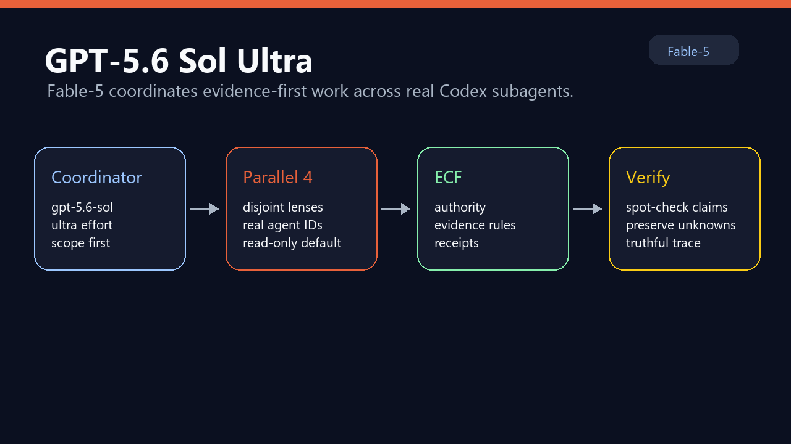
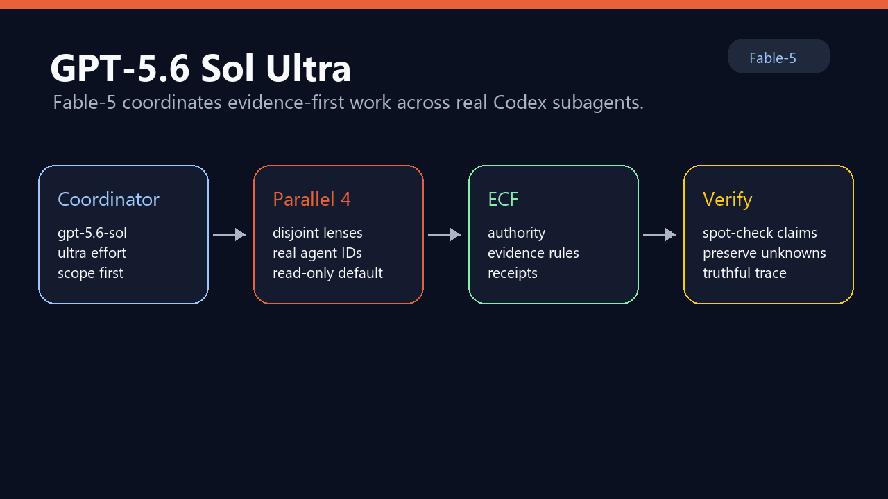

# Fable-5 for Codex

[](https://github.com/rhein1/fable5-codex/actions/workflows/validate.yml)
[](LICENSE)

<p align="center">
  
</p>

Fable-5 for Codex is an OpenAI Codex plugin for evidence-first AI code review, codebase audits, fact checks, codebase understanding, design options, repo-wide sweeps, ECF run contracts, and subagent workflows. It packages six reusable Codex skills for serious software engineering work where source-backed proof matters. The current alpha ships Micro ECF-style run contracts so Codex can record scope, authority, lenses, evidence policy, verification policy, and a final Workflow Trace.

<p align="center">
  
</p>

<p align="center">
  
</p>

## Quick Start

Install directly from GitHub:

```powershell
npx github:rhein1/fable5-codex
```

The npm package metadata is publish-ready. After npm authentication is available and the package is published, the shorter install path will be:

```powershell
npx fable5-codex
```

Then start a new Codex thread and invoke a skill:

```text
Use $fable-audit. Scope: this repository. Focus: correctness, security, data, operations, tests, and docs-vs-reality. Include a Workflow Trace.
```

For the highest-capability profile, select **GPT-5.6 Sol** and **Ultra** in Codex, or use the included wrapper/config template. Ultra is the reasoning and multi-agent setting; the model ID remains `gpt-5.6-sol`.

## What This Repo Contains

- `assets/brand/`: README and repository brand images
- `assets/benchmarks/`: benchmark chart images generated from measured runs
- `benchmarks/`: reproducible baseline-vs-plugin benchmark harness and raw outputs
- `plugins/fable5-codex/`: installable Codex plugin
- `.agents/plugins/marketplace.json`: repo-local marketplace catalog
- `plugins/fable5-codex/references/`: ECF-style run-contract guidance used by the installed skills
- `plugins/fable5-codex/templates/`: starter ECF/Fable run-contract JSON and review contract
- `bin/install.mjs`: GitHub/npx installer for personal or project-local Codex marketplaces
- `examples/`: prompt calls, toy repo, and expected report examples
- `examples/gallery/`: polished sample outputs for audits, reviews, fact checks, and understanding
- `evals/`: fixtures for fact-check, audit, and sweep validation
- `docs/`: method, install, architecture, and schema notes
- `scripts/validate-package.mjs`: cross-platform package validation (`validate-package.ps1` remains a compatibility wrapper)
- `scripts/render-benchmark-charts.mjs`: dependency-free cross-platform PNG benchmark renderer
- `scripts/sync-personal-plugin.ps1`: copy the canonical repo plugin into the personal plugin location

## Skills

- `$fable-audit`: ranked bug, risk, and integration audit
- `$fable-deep-review`: PR or branch review with verification passes
- `$fable-fact-check`: claim-by-claim verification against source/runtime evidence
- `$fable-understand`: source-grounded explanation of how a system works
- `$fable-design-options`: design alternatives with tradeoffs and migration notes
- `$fable-sweep`: repo-wide change workflow with discovery, implementation, and verification

## GPT-5.6 Sol Ultra

Fable-5 v0.4 is tuned for `gpt-5.6-sol` with `ultra` reasoning on large or high-risk work. OpenAI describes Ultra as its highest-capability setting: it coordinates multiple agents across parallel workstreams, using four agents by default. The plugin pairs that runtime with explicit Fable lenses, ECF authority boundaries, local verification, and a truthful Workflow Trace.

Use the ready-to-copy config at `plugins/fable5-codex/templates/sol-ultra.config.toml`, or run the wrapper directly:

```powershell
.\plugins\fable5-codex\scripts\fable5-codex.ps1 -Mode audit -Scope . -Subagents
```

The wrapper defaults to `gpt-5.6-sol` plus `ultra`. Override with `-Model` and `-ReasoningEffort` when a smaller task does not justify Ultra. See [Sol Ultra setup and behavior](docs/sol-ultra.md) and the [official GPT-5.6 announcement](https://openai.com/index/gpt-5-6/).

CLI requirement: GPT-5.6 needs Codex CLI `0.144.0` or newer. The packaged wrappers enforce this before launch.

## Subagents

Fable-5 audits now report a visible `Workflow Trace` every time. Sol Ultra can proactively delegate useful parallel work; Fable skills also explicitly request real Codex subagents for large or high-risk tasks when the runtime exposes a subagent tool and the user has not opted out. Without a subagent tool, the skill runs as `single-agent multi-lens` and says so instead of implying independent parallel review happened.

Large/high-risk means repo-wide or cross-package work, exhaustive audit, deep review, broad sweep, migration, launch readiness, "find every place", or anything touching money, auth, privacy, secrets, data migrations, public APIs, serialized contracts, deploys, or production operations.

```text
Use $fable-audit with real Codex subagents and an ECF run contract. I explicitly authorize parallel subagents for this run. Scope: src/billing. Focus: money math, idempotency, integration wiring, and docs-vs-reality. Spawn four independent read-only lenses: correctness-integration, security-privacy-authz, data-migrations-idempotency, and operations-tests-docs. The main agent must verify candidates locally before final findings. Do not claim multi-agent mode unless real subagent IDs exist. Include the ECF contract and Workflow Trace.
```

## ECF Run Contracts

Fable-5 uses ECF-style contracts as the governance layer for a run. The contract records intent and evidence rules; the Codex runtime still has to provide the actual subagent tool.

- Contract reference: `plugins/fable5-codex/references/ecf-run-contract.md`
- Starter JSON: `plugins/fable5-codex/templates/fable-ecf-run-contract.json`
- PR review contract: `plugins/fable5-codex/templates/fable-review-contract.md`
- Ledger schema: `plugins/fable5-codex/schemas/fable5.schema.json`

Authority split: subagents may research, map, plan, draft, find, or verify inside assigned lenses. The main agent owns final findings, spot-checking, writes, commits, pushes, GitHub comments, deploys, publishing, credential mutation, and any money/wallet action.

Public OSS boundary: this package includes Micro ECF-style contracts and reporting rules only. It does not include private Full ECF internals.

## Benchmark Snapshot

<p align="center">
  
</p>

<p align="center">
  
</p>

<p align="center">
  
</p>

Latest published measured run: `20260713T234332Z`, `gpt-5.6-sol`, matched `ultra` reasoning effort, 600s per trial. Across three intentionally tiny fixtures, the Fable-5 path raised average composite from `81.7` to `100.0` (`+18.3` points), expected-concept recall from `93.3` to `100.0`, evidence markers from `78.3` to `100.0`, and explicit unknowns from `0.0` to `100.0`. Average wall time increased from `144.5s` to `344.0s` (`2.38x`). All six final trials completed successfully.

Subagents were explicitly disabled in this run to isolate workflow discipline on small fixtures. These results do not measure broad model quality or prove multi-agent gains. This run predates the alpha.3 isolation hardening: its baseline ignored user config, while its plugin arm used the active installed-plugin environment. The outputs and timings remain valid historical measurements, but they are not clean plugin-only causal attribution. One plugin trial initially hit provider capacity and was retried in place with the same model, effort, fixture, and mode; the run record preserves that qualification note. A complete alpha.3 isolated run is required before replacing these charts.

See `benchmarks/README.md` for the command, scoring rubric, caveats, and raw outputs.

## Brand Assets

- `assets/brand/fable5-hero.png`: README and social-preview banner
- `assets/brand/fable5-sol-ultra.png`: GPT-5.6 Sol Ultra profile banner
- `assets/brand/fable5-mark.png`: compact repo mark for plugin cards or docs
- `assets/benchmarks/fable5-benchmark-*-20260713T234332Z.png`: cache-stable charts for the latest measured run
- `plugins/fable5-codex/assets/fable5-demo.gif`: short install/run/trace demo for README and plugin screenshots

## Install From GitHub

```powershell
codex plugin marketplace add rhein1/fable5-codex --ref main
codex plugin add fable5-codex@fable5-local
```

Then restart Codex if needed, start a new thread, and call a skill directly. Large/high-risk tasks request real subagents automatically when the runtime exposes them. For a smaller scope where you still want the full multi-subagent path, use an explicit authorization prompt:

```text
Use $fable-audit with real Codex subagents and an ECF run contract. I explicitly authorize parallel subagents for this run. Scope: this repository. Focus: correctness, security, data/migrations, operations/tests, and docs-vs-reality. Spawn four independent read-only lenses: correctness-integration, security-privacy-authz, data-migrations-idempotency, and operations-tests-docs. The main agent must verify candidates locally before final findings. Do not claim multi-agent mode unless real subagent IDs exist. Include the ECF contract and Workflow Trace.
```

## Install With npx

This repo ships a copy-based installer for users who prefer a single command. The live public install path is GitHub:

```powershell
npx github:rhein1/fable5-codex
```

The npm package metadata is ready, but npm publishing requires an authenticated npm account. After publish, this shorter command will work:

```powershell
npx fable5-codex
```

The installer copies `plugins/fable5-codex` into the Codex personal marketplace layout, writes or updates `~/.agents/plugins/marketplace.json`, then runs:

```powershell
codex plugin add fable5-codex@personal
```

On Windows, the installer deliberately does not launch `codex` through a command shell; it prints the exact `codex plugin add` command for you to run. Replacing an existing copied plugin directory requires an explicit `--force`. Supported options are `--project`, `--dry-run`, `--force`, `--no-codex-add`, `--marketplace-name=<name>`, and `--help`/`-h`; unknown or duplicate options fail before target selection, including when help is requested. A project-local install run from this repository recognizes that the source is already in place and never deletes or recopies it.

For a repo-local marketplace in the current directory:

```powershell
npx github:rhein1/fable5-codex --project
```

After npm publish:

```powershell
npx fable5-codex --project
```

## Examples Gallery

- [Fable audit sample](examples/gallery/fable-audit-payment-risk.md)
- [Fable fact-check sample](examples/gallery/fable-fact-check-status.md)
- [Fable understand sample](examples/gallery/fable-understand-boot-flow.md)
- [Fable deep-review sample](examples/gallery/fable-deep-review-pr.md)

## Install From A Local Checkout

Register and install the repo marketplace:

```powershell
cd C:\projects\fable5-codex
codex plugin marketplace add .
codex plugin add fable5-codex@fable5-local
```

Then restart Codex if needed, open **Plugins**, choose the **Fable-5 Local Plugins** marketplace source, and confirm `fable5-codex` is installed. Start a new thread and call a skill directly:

```text
Use $fable-understand. Scope: this repository. Question: what files define the Fable-5 Codex plugin, and what are the six installed skills? Include file citations and an UNKNOWNS section.
```

The repo-local marketplace entry intentionally uses a relative source path:

```json
"path": "./plugins/fable5-codex"
```

That lets someone clone the repo without depending on a personal Windows path.

## Smoke Tests

After installing the plugin in Codex, run these smoke prompts:

```text
Use $fable-understand. Scope: C:\projects\fable5-codex. Question: what does this plugin provide, how is it installed, and what unknowns remain? Include exact file citations.
```

```text
Use $fable-fact-check. Doc: C:\projects\fable5-codex\README.md. Check every installed, supported, validated, and works claim against the files on disk.
```

```text
Use $fable-audit with real Codex subagents and an ECF run contract. I explicitly authorize parallel subagents for this run. Scope: C:\projects\fable5-codex. Focus: Codex plugin compatibility, path assumptions, Windows compatibility, overbroad promises, missing install steps, schema/reporting gaps, and docs-vs-reality. Spawn four independent read-only lenses: correctness-integration, security-privacy-authz, data-migrations-idempotency, and operations-tests-docs. The main agent must verify candidates locally before final findings. Do not claim multi-agent mode unless real subagent IDs exist. Include the ECF contract and Workflow Trace.
```

For file-only package validation:

```powershell
npm test
npm run validate
npm run validate:artifact
```

If you maintain a personal install on the same machine, treat `plugins/fable5-codex/` in this repo as canonical and sync the personal copy from it:

```powershell
.\scripts\sync-personal-plugin.ps1
```

## Status

This is a v0.4 alpha repo-scoped package. Static validation and Codex CLI skill smokes are captured in `VALIDATION.md`; Codex app UI smoke remains a separate manual check before calling it production-ready.
