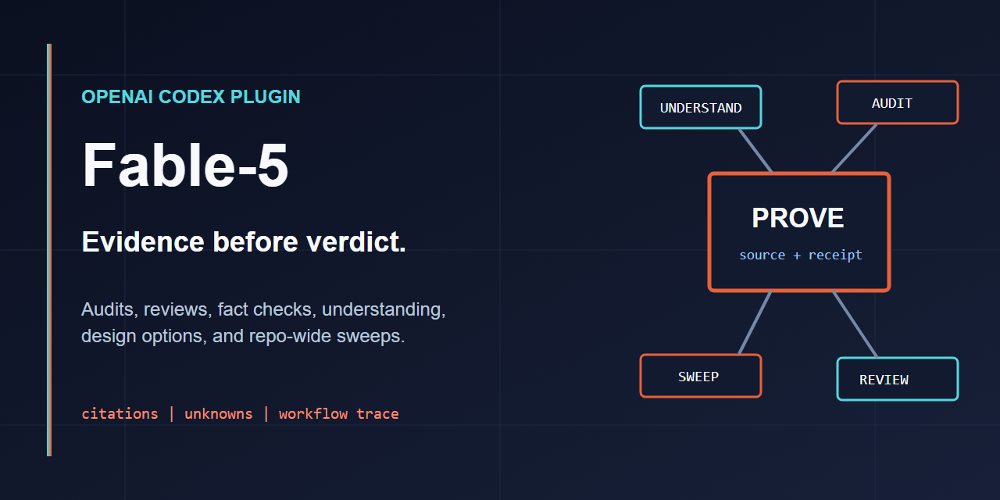
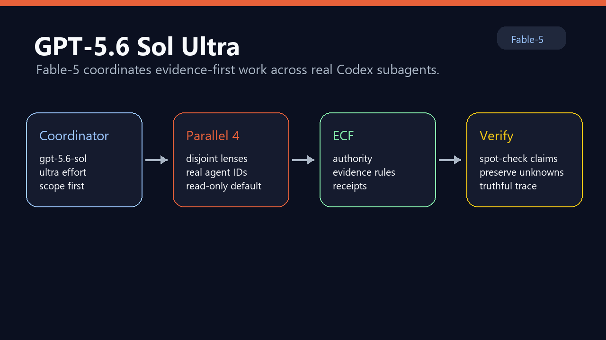
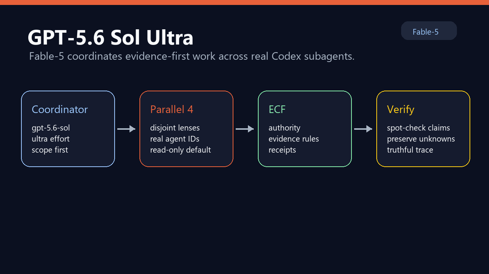
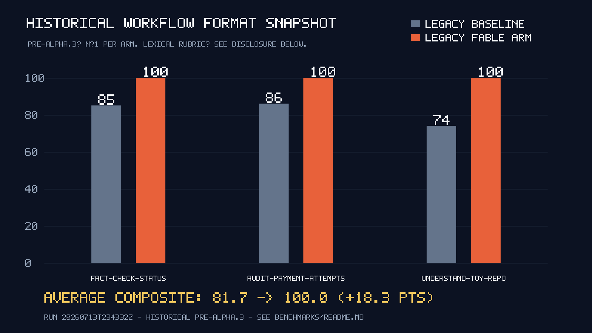
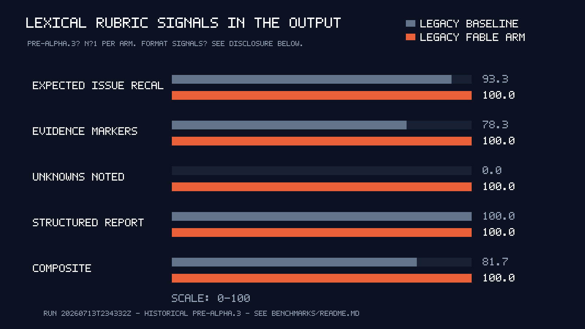
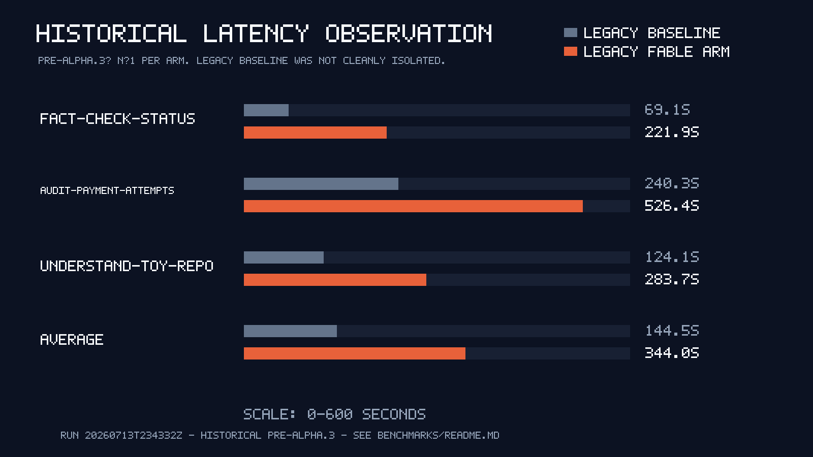

# Fable-5 for Codex

<p align="center">
  
</p>

[](https://github.com/rhein1/fable5-codex/actions/workflows/validate.yml)
[](LICENSE)

## Make Codex show its evidence, authority, and verification—not just its answer.

**Fable-5 is an evidence-first Codex plugin from Agoragentic.** It packages six reusable engineering workflows for audits, deep reviews, fact checks, codebase understanding, design options, and repository-wide changes.

Each workflow is designed to record:

- scope and authority;
- evidence policy;
- verification performed;
- explicit unknowns;
- whether real subagents were used;
- a truthful final Workflow Trace.

```powershell
npx github:rhein1/fable5-codex#v0.4.0-alpha.2
codex plugin add fable5-codex@personal
```

Then start a new Codex thread:

```text
Use $fable-audit.
Scope: this repository.
Focus: correctness, security, data, operations, tests, and docs-vs-reality.
Include a Workflow Trace.
```

<p>
  <a href="#install"><strong>Install</strong></a>
  ·
  <a href="#six-workflows"><strong>See the workflows</strong></a>
  ·
  <a href="#examples-gallery"><strong>Read sample outputs</strong></a>
  ·
  <a href="#benchmark-snapshot"><strong>Inspect benchmark evidence</strong></a>
</p>

> **Release status:** `v0.4.0-alpha.2` is the latest public tagged release. `main` contains the `0.4.0-alpha.3` release candidate. Do not cite alpha.3 as published until a signed tag and GitHub prerelease exist.

## What Fable-5 changes

A normal coding-agent prompt can produce a plausible review without making it obvious:

- which files were actually inspected;
- whether runtime behavior was verified;
- which assumptions remained unresolved;
- whether parallel agents really ran;
- who owned the final write, commit, or deployment decision.

Fable-5 adds a repeatable evidence and authority contract around that work.

```text
user goal
→ ECF-style run contract
→ one or more explicit review lenses
→ source/runtime evidence collection
→ main-agent verification
→ ranked findings or implementation
→ Workflow Trace + unknowns
```

Fable-5 improves workflow discipline. It does not make every finding correct, replace local verification, or turn model output into an audit opinion or security certification.

## Install

### Public tagged release

```powershell
npx github:rhein1/fable5-codex#v0.4.0-alpha.2
```

On Windows, activate the copied personal plugin after the installer completes:

```powershell
codex plugin add fable5-codex@personal
```

The installer prints the exact activation command because it deliberately does not launch the Codex shim through a Windows command shell.

For a project-local marketplace:

```powershell
npx github:rhein1/fable5-codex#v0.4.0-alpha.2 --project
```

### Local checkout

```powershell
git clone https://github.com/rhein1/fable5-codex.git
cd fable5-codex
codex plugin marketplace add .
codex plugin add fable5-codex@fable5-local
```

Restart Codex if required, start a new thread, and call a skill directly.

### npm status

The package metadata and installer are publish-ready, but the public install path remains GitHub until npm publication occurs. After publication, the intended shorter path is:

```powershell
npx fable5-codex
```

Do not represent that npm command as currently published unless the registry confirms it.

## Six workflows

| Skill | Use it for |
|---|---|
| `$fable-audit` | Ranked bugs, risks, integration gaps, and docs-vs-reality findings |
| `$fable-deep-review` | PR or branch review with verification passes and actionable findings |
| `$fable-fact-check` | Claim-by-claim verification against repository or runtime evidence |
| `$fable-understand` | Source-grounded explanation of how a system actually works |
| `$fable-design-options` | Alternative designs with tradeoffs, migration notes, and decision criteria |
| `$fable-sweep` | Repository-wide discovery, implementation, and verification workflow |

### Fastest audit prompt

```text
Use $fable-audit.
Scope: this repository.
Focus: correctness, security, privacy, data, operations, tests, and docs-vs-reality.
Rank findings by severity.
Verify candidates locally before reporting them.
Include explicit unknowns and a Workflow Trace.
```

### Fastest understanding prompt

```text
Use $fable-understand.
Scope: this repository.
Question: What are the main execution paths, trust boundaries, and unresolved unknowns?
Cite exact files and include an UNKNOWNS section.
```

## GPT-5.6 Sol Ultra profile

<p align="center">
  
</p>

The repository includes a high-capability profile for `gpt-5.6-sol` with `ultra` reasoning on large or high-risk work. The packaged wrappers enforce the repository's declared minimum Codex CLI version before launch.

Use the ready-to-copy template:

```text
plugins/fable5-codex/templates/sol-ultra.config.toml
```

Or run the PowerShell wrapper:

```powershell
.\plugins\fable5-codex\scripts\fable5-codex.ps1 \
  -Mode audit \
  -Scope . \
  -Subagents
```

Override model and reasoning settings when a smaller task does not justify the highest-cost profile. The model/runtime configuration does not weaken Fable-5's evidence, authority, and truthful-reporting requirements.

See [Sol Ultra setup and behavior](docs/sol-ultra.md).

## Subagents without fake parallelism

Fable-5 requests real Codex subagents for suitable large or high-risk work when the runtime exposes a subagent tool and the user has not opted out.

Large/high-risk includes work such as:

- repository-wide audits or migrations;
- exhaustive review or broad sweeps;
- money, billing, wallets, or settlement;
- authentication, authorization, privacy, or secrets;
- data migrations or idempotency;
- public APIs or serialized contracts;
- deployment or production operations.

When no subagent tool is available, the workflow runs as **single-agent multi-lens** and says so. It must not imply independent parallel review without real subagent IDs.

Example:

```text
Use $fable-audit with real Codex subagents and an ECF run contract.
I explicitly authorize parallel read-only subagents for this run.
Scope: src/billing.
Spawn four lenses:
1. correctness and integration
2. security, privacy, and authorization
3. data, migrations, and idempotency
4. operations, tests, and docs-vs-reality
The main agent must verify candidates locally before final findings.
Do not claim multi-agent mode unless real subagent IDs exist.
Include the ECF contract, unknowns, and Workflow Trace.
```

## ECF run contracts

Fable-5 uses a public ECF-style run contract as the governance layer for each workflow. The contract records intent and evidence rules; the Codex runtime remains responsible for providing actual tools and subagent execution.

- [Run-contract reference](plugins/fable5-codex/references/ecf-run-contract.md)
- [Starter contract JSON](plugins/fable5-codex/templates/fable-ecf-run-contract.json)
- [PR review contract](plugins/fable5-codex/templates/fable-review-contract.md)
- [Ledger schema](plugins/fable5-codex/schemas/fable5.schema.json)

Authority split:

```text
subagents
→ research, map, plan, draft, find, or verify inside assigned read-only lenses

main agent
→ verify findings and own final output

owner / authorized host
→ writes, commits, pushes, comments, deploys, publishes,
  changes credentials, or performs money/wallet actions
```

The public plugin contains Micro ECF-style contracts and reporting rules. It does not include private Full ECF internals.

## Demo

<p align="center">
  
</p>

The animation illustrates the packaged workflow. The repository files, examples, tests, and benchmark records remain the source of truth.

## Examples gallery

- [Audit sample: payment risk](examples/gallery/fable-audit-payment-risk.md)
- [Fact-check sample: status claims](examples/gallery/fable-fact-check-status.md)
- [Understand sample: boot flow](examples/gallery/fable-understand-boot-flow.md)
- [Deep-review sample: pull request](examples/gallery/fable-deep-review-pr.md)

Samples demonstrate format and evidence discipline. They are not proof that every future run will find the same issues or reach the same conclusion.

## Benchmark snapshot

<p align="center">
  
</p>

<p align="center">
  
</p>

<p align="center">
  
</p>

The latest published measured repository run is `20260713T234332Z`. It used `gpt-5.6-sol`, matched `ultra` reasoning effort, a 600-second limit per trial, and three intentionally small fixtures.

The historical run reported:

- workflow-format/lexical rubric composite: `81.7 → 100.0`;
- expected-concept recall: `93.3 → 100.0`;
- evidence markers: `78.3 → 100.0`;
- explicit unknowns: `0.0 → 100.0`;
- average wall time: `144.5s → 344.0s` (`2.38×`).

All six final trials completed.

### Required qualifications

- The fixtures were intentionally small.
- The measurements evaluate workflow-format and lexical rubric signals, not broad model quality.
- Subagents were disabled to isolate workflow discipline.
- The run predates alpha.3 environment-isolation hardening.
- Its baseline ignored user config while the plugin arm used the active installed-plugin environment, so it is not clean plugin-only causal attribution.
- One plugin trial encountered provider capacity and was retried with the same model, effort, fixture, and mode.
- A complete isolated alpha.3 run is required before replacing the qualified charts.

See [the benchmark methodology and raw outputs](benchmarks/README.md).

## Repository layout

```text
.agents/plugins/marketplace.json       repo-local plugin catalog
assets/brand/                          product and social images
assets/benchmarks/                     qualified benchmark charts
benchmarks/                            harness, raw outputs, and methodology
bin/install.mjs                        GitHub/npx installer
docs/                                  install, method, architecture, and schemas
evals/                                 audit, fact-check, and sweep fixtures
examples/                              prompts and expected reports
examples/gallery/                      polished sample outputs
plugins/fable5-codex/                  installable Codex plugin
plugins/fable5-codex/references/       ECF/run-contract guidance
plugins/fable5-codex/templates/        config and contract templates
scripts/                               validation, charts, demo, and sync tools
test/                                  package and behavior tests
```

## Validation

```powershell
npm test
npm run validate
npm run validate:artifact
npm run pack:dry-run
```

For a local installed-plugin smoke test:

```text
Use $fable-fact-check.
Document: README.md.
Check every installed, supported, validated, and works claim against files on disk.
Include exact citations and explicit unknowns.
```

Treat `plugins/fable5-codex/` in this repository as canonical. Use the provided sync script for a personal copy:

```powershell
.\scripts\sync-personal-plugin.ps1
```

## Product boundary

Fable-5 is:

- an installable Codex plugin;
- evidence-first workflow guidance and validation;
- explicit authority and verification discipline;
- compatible with single-agent and real-subagent runs;
- public Micro ECF-style run contracts;
- reproducible examples, evals, and benchmark artifacts.

Fable-5 is not:

- an independent security audit;
- a guarantee that all bugs will be found;
- a hosted agent runtime;
- wallet or settlement infrastructure;
- private Full ECF;
- automatic authority to write, commit, push, deploy, publish, or spend.

## Where this fits

**Fable-5 keeps its own product identity while belonging to the Agoragentic trust stack.**

```text
Fable-5
→ evidence-first engineering workflows inside Codex

Micro ECF / ECF Core
→ persistent local context, policy, provenance, and source routing

Harness Core
→ tool/action policy, approvals, evidence, and local receipts

Triptych OS
→ governed hosted-agent runtime

Marketplace / Interchange
→ agent work, payments, and cross-market reconciliation
```

- [Agoragentic Integrations](https://github.com/rhein1/agoragentic-integrations)
- [Micro ECF](https://github.com/rhein1/agoragentic-micro-ecf)
- [ECF Core](https://github.com/rhein1/agoragentic-ecf-core)
- [Harness Core](https://github.com/rhein1/agoragentic-integrations/tree/main/harness-core)
- [Triptych OS](https://agoragentic.com/agent-os/)
- [Marketplace](https://agoragentic.com/marketplace/)
- [Interchange](https://agoragentic.com/interchange/)

Use the [canonical ecosystem profile](https://github.com/rhein1/agoragentic-integrations/blob/main/ecosystem.json) for current portfolio metadata. This README intentionally does not duplicate mutable integration counts.

## Brand assets

- `assets/brand/fable5-hero.png` — original README hero
- `assets/brand/fable5-social.png` — repository and link-card preview
- `assets/brand/fable5-sol-ultra.png` — Sol Ultra profile
- `assets/brand/fable5-mark.png` — compact plugin mark
- `plugins/fable5-codex/assets/fable5-demo.gif` — short install/run/trace demo
- `assets/benchmarks/fable5-benchmark-*-qualified.png` — visibly qualified historical charts

Repository owners still need to upload the chosen social card in GitHub settings; committing an image does not change the repository social-preview setting.

## Security and license

See [SECURITY.md](SECURITY.md) for vulnerability reporting.

MIT. See [LICENSE](LICENSE).
