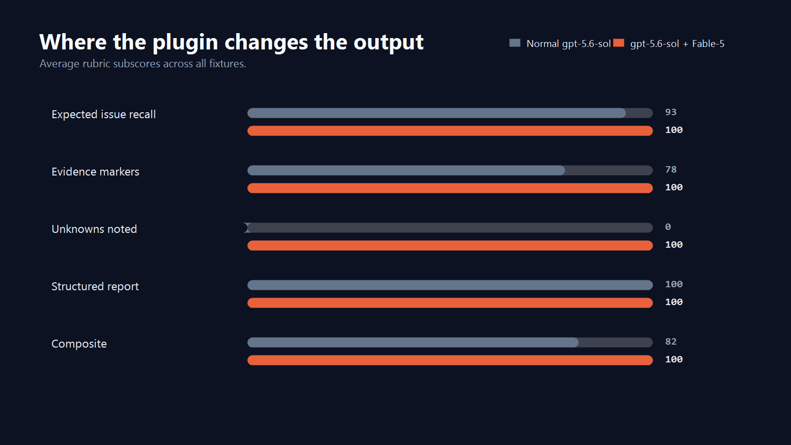
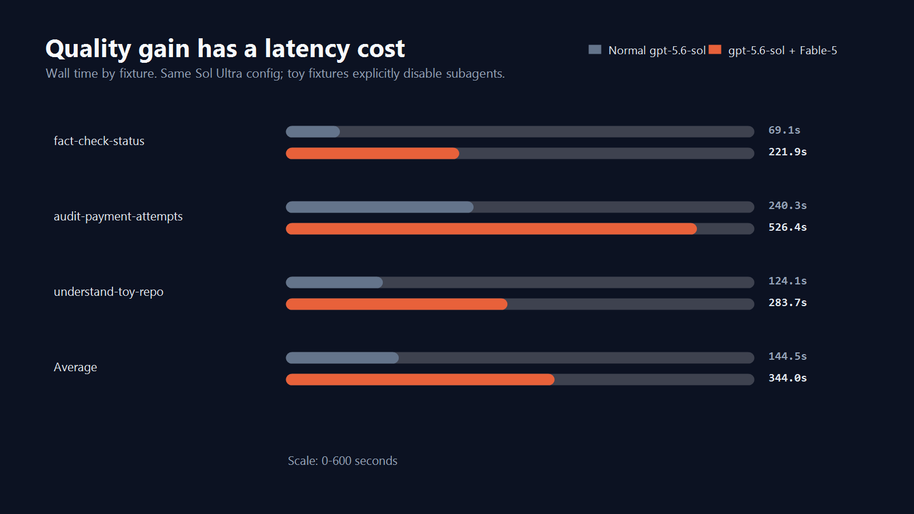

# Fable-5 Benchmark

This benchmark compares the same Codex model and reasoning effort in two modes. The runner now defaults to the Fable-5 v0.4 profile:

- Model: `gpt-5.6-sol`
- Reasoning effort: `ultra`

Run it with:

```powershell
.\scripts\run-benchmarks.ps1 -Model 'gpt-5.6-sol' -ReasoningEffort 'ultra' -TimeoutSeconds 600
```

Use `-CodexExecutable <path>` to test with an isolated current CLI without replacing a machine-wide installation.

Ultra is an effort setting, not a separate model ID. Keep the baseline and plugin settings matched so the benchmark measures the workflow rather than comparing different model configurations.

The two modes are:

- **Baseline:** `gpt-5.6-sol` with user config ignored and no Fable-5 skill invoked.
- **Plugin:** `gpt-5.6-sol` with the installed Fable-5 plugin, explicitly invoking the relevant `$fable-*` skill.

It is a workflow benchmark, not a broad model or multi-agent benchmark. The fixtures are intentionally tiny, and the default runner explicitly disables subagents so proactive Ultra delegation does not add unrelated fan-out. The measurable difference is Fable-5's discipline around recall, explicit unknowns, coverage notes, and structured evidence. Use `-AllowSubagents` only for a separate benchmark designed to measure delegation. Runtime reliability matters too: timeout failures count as failed benchmark trials.

## Latest Committed Run

- Run id: `20260713T234332Z`
- Model: `gpt-5.6-sol`
- Reasoning effort: `ultra`
- Subagents allowed: `false`
- Timeout: 600 seconds per trial
- Codex CLI: `0.144.3` in an isolated repo-local install
- Command:

```powershell
.\scripts\run-benchmarks.ps1 -Model 'gpt-5.6-sol' -ReasoningEffort 'ultra' -TimeoutSeconds 600 -CodexExecutable '.\tmp\codex-cli\node_modules\.bin\codex.ps1'
```

The runner copies `evals/` and `examples/` into `tmp/benchmarks/<run-id>/` before invoking nested Codex runs. That keeps benchmark execution isolated from the source tree.

The final run completed all six trials. The first `understand-toy-repo` plugin attempt returned a provider-capacity error. It was retried in place with the same model, effort, timeout, fixture, and plugin mode using `-ResumeRunId`, without rerunning successful rows. See `benchmarks/results/20260713T234332Z/RUN.md`.

## Charts






## Scoring Rubric

Composite score:

- 60% expected concept recall
- 20% evidence marker coverage
- 10% explicit unknowns / coverage-gap language
- 10% structured report language

Expected concept recall is regex-scored against fixed fixture-specific concepts in `scripts/run-benchmarks.ps1`. This is intentionally transparent and lightweight; it should not be treated as a substitute for a larger human-reviewed eval suite.

## Result Summary

| Case | Baseline composite | Fable-5 composite | Main difference |
|---|---:|---:|---|
| `fact-check-status` | 85.0 | 100.0 | Fable-5 cited every evidence marker and made unknowns explicit. |
| `audit-payment-attempts` | 86.0 | 100.0 | Fable-5 retained full issue recall while closing evidence and coverage gaps. |
| `understand-toy-repo` | 74.0 | 100.0 | Fable-5 recovered the missing entrypoint and completed evidence/unknowns reporting. |

Average composite: `81.7 -> 100.0` (`+18.3 pts`). Expected concept recall improved `93.3 -> 100.0`, evidence markers `78.3 -> 100.0`, explicit unknowns `0.0 -> 100.0`, and structure remained `100.0 -> 100.0`.

That quality gain had a measured latency cost: average wall time increased from `144.5s` to `344.0s` (`2.38x`). Per case, baseline/Fable-5 times were `69.1s/221.9s`, `240.3s/526.4s`, and `124.1s/283.7s`.

## Raw Outputs

- `benchmarks/results/latest-summary.csv`
- `benchmarks/results/latest-summary.json`
- `benchmarks/results/20260713T234332Z/RUN.md`
- `benchmarks/results/20260713T234332Z/fact-check-status-baseline.md`
- `benchmarks/results/20260713T234332Z/fact-check-status-plugin.md`
- `benchmarks/results/20260713T234332Z/audit-payment-attempts-baseline.md`
- `benchmarks/results/20260713T234332Z/audit-payment-attempts-plugin.md`
- `benchmarks/results/20260713T234332Z/understand-toy-repo-baseline.md`
- `benchmarks/results/20260713T234332Z/understand-toy-repo-plugin.md`

CLI logs are ignored by git because they include local runtime noise and machine paths.
Committed report citations are normalized from the isolated run workspace to canonical `evals/` and `examples/` paths so they remain clickable on GitHub.
